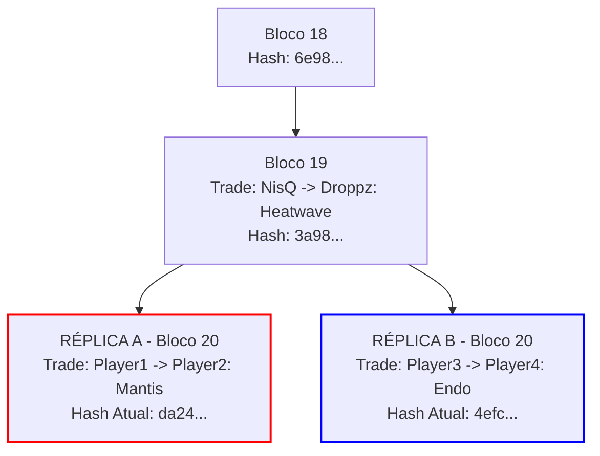

## Diagrama das Réplicas Divergentes (Fork)

```mermaid
graph TD
    B18[Bloco 18<br/>Hash: 6e98...] --> B19[Bloco 19<br/>Trade: NisQ -> Droppz: Heatwave<br/>Hash: 3a98...]
    
    B19 --> B20A[RÉPLICA A - Bloco 20<br/>Trade: Player1 -> Player2: Mantis<br/>Hash Atual: da24...]
    B19 --> B20B[RÉPLICA B - Bloco 20<br/>Trade: Player3 -> Player4: Endo<br/>Hash Atual: 4efc...]
    
    style B20A stroke:#ff0000,stroke-width:2px
    style B20B stroke:#0000ff,stroke-width:2px
```